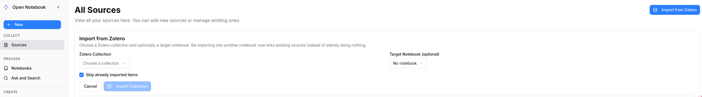
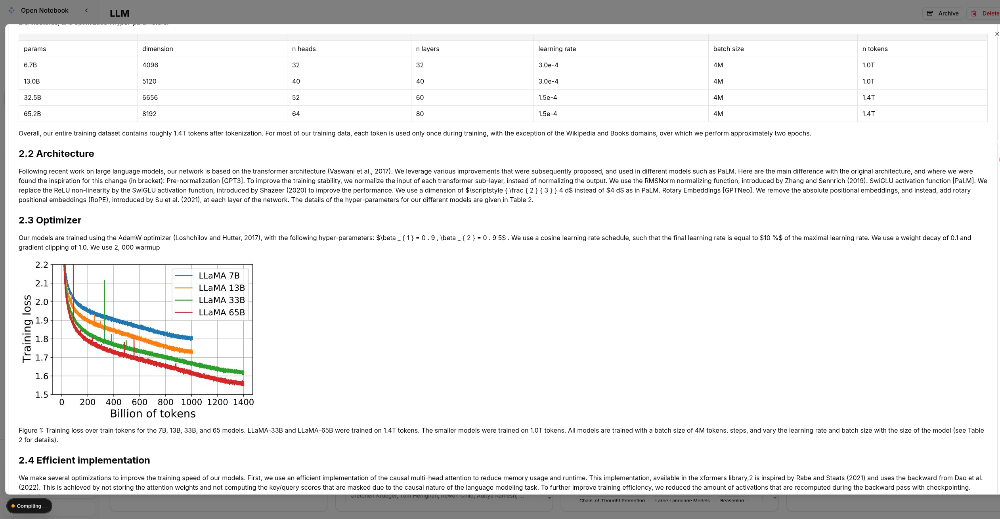
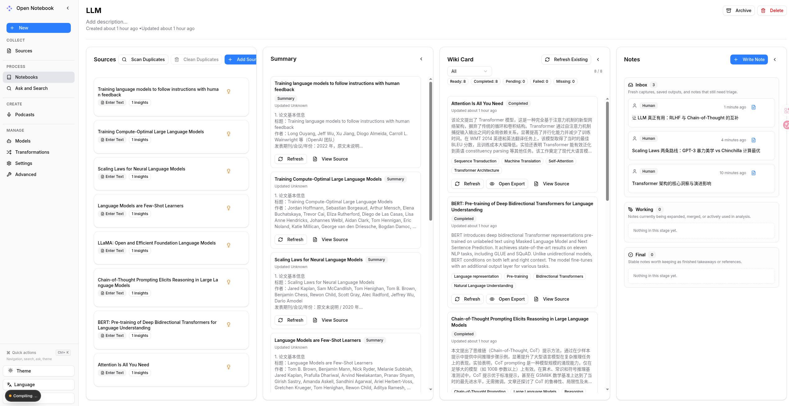
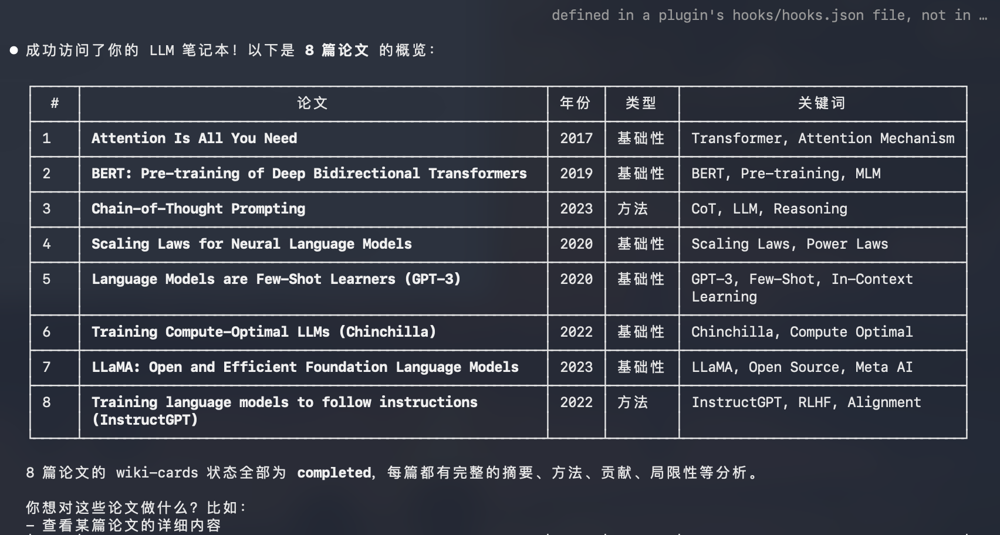
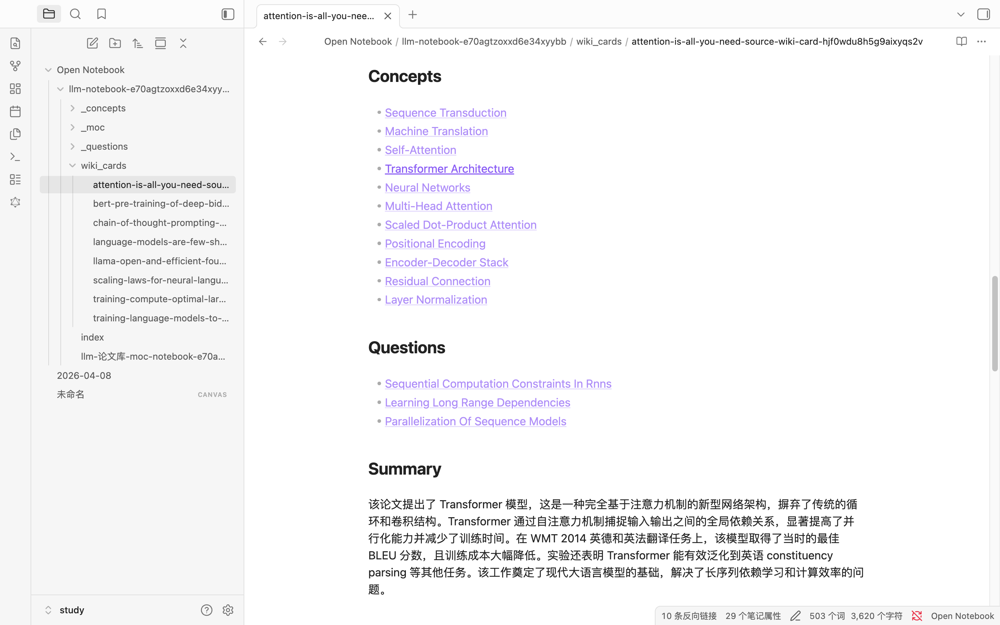

<a id="readme-top"></a>

[![MIT License][license-shield]][license-url]
[](https://linux.do)
<!-- [![LinkedIn][linkedin-shield]][linkedin-url] -->


<!-- PROJECT LOGO -->
<br />
<div align="center">
  <a href="https://github.com/suzen2613-glitch/open-research-notebook">
    Open Research Notebook
  </a>

  <h3 align="center">Open Research Notebook</h3>

  <p align="center">
    A research-focused derivative of Open Notebook for Zotero-driven paper ingestion,
    hybrid PDF conversion, structured summaries, and wiki-style knowledge cards.
    <br />
    Built for turning paper collections into an LLM-ready research knowledge base.
    <br />
    <br />
    <a href="docs/0-START-HERE/index.md">📚 Get Started</a>
    ·
    <a href="docs/3-USER-GUIDE/index.md">📖 User Guide</a>
    ·
    <a href="docs/2-CORE-CONCEPTS/index.md">✨ Features</a>
    ·
    <a href="docs/1-INSTALLATION/index.md">🚀 Deploy</a>
  </p>
</div>

## A research workspace built on Open Notebook

> This repository is a customized derivative of [`lfnovo/open-notebook`](https://github.com/lfnovo/open-notebook), published under the original MIT license with additional workflow and UI changes.

This fork keeps the self-hosted and multi-model foundation of Open Notebook, but shifts the product toward an academic research workflow:

- ingest papers from Zotero
- convert PDFs with local or cloud-backed pipelines
- generate paper summaries and structured wiki cards
- maintain a notebook layout that is easier to use as an LLM-ready knowledge base
- export cleaner research artifacts into downstream tools such as Obsidian

### 1. Import From Zotero



Importing papers starts from Zotero collections instead of isolated file uploads. This makes the notebook closer to a real paper-reading workflow and preserves a cleaner bridge from literature collection into the research workspace.

### 2. PDF Conversion Pipeline



PDF conversion is treated as a first-class workflow in this fork. The system can use local conversion engines or API-backed conversion paths, switch between newer tools, and fall back pragmatically when one engine is not ideal for a paper.

Converted figures and image assets are normalized into the workspace and rendered directly in the notebook UI, so converted papers are readable as real mixed text-and-figure documents instead of broken external image links.

### 3. Four-Column Research Notebook



The main notebook page is organized into four distinct columns: `Sources`, `Summary`, `Wiki Card`, and `Notes`. This layout separates reading, extraction, knowledge modeling, and writing so the notebook can act as a better LLM-ready knowledge base.

### 4. API And CLI-Friendly Workflows



The project is not limited to the browser UI. It can also be queried through APIs and CLI-style workflows, which makes it easier to automate paper summaries, inspect wiki-card status, and integrate the workspace into larger research tooling.

#### Why API Access Matters

- automate paper ingestion, PDF conversion, and downstream workflows
- fetch `summary` and `wiki card` artifacts programmatically instead of only through the UI
- integrate the notebook with CLI tools, scripts, agents, and external research pipelines
- treat the workspace as a reusable knowledge service, not just a web app

### 5. Obsidian-Oriented Export



Structured wiki cards can be exported into an Obsidian-friendly layout with concepts, questions, summaries, and stable file organization. This makes the workspace useful both as a live system and as a downstream knowledge layer.

### What Is A Wiki Card?

A `wiki card` is not just another note. It is a canonical, structured knowledge object derived from a paper source.

- `source` keeps the raw paper content
- `summary` keeps the readable synthesis
- `wiki card` keeps the normalized metadata layer: concepts, questions, domains, paper type, relations, and navigation-oriented fields

This structure makes the notebook more useful for retrieval, comparison, MOC pages, Obsidian export, and later LLM workflows that need stable knowledge objects instead of only long-form text.

### At a glance

- `Zotero -> Source -> Summary -> Wiki Card -> Notes` as a primary workflow
- local PDF conversion plus cloud-backed conversion with practical fallback
- four-column notebook layout for reading, extracting, curating, and writing
- structured metadata designed for MOC, Dataview, retrieval, and downstream LLM use
- duplicate-aware paper management based on real paper titles instead of only filenames

### Research workflow

1. Import a paper collection from Zotero or upload PDFs directly.
2. Convert PDFs with local engines or API-backed conversion.
3. Generate a canonical `summary` for each paper.
4. Generate a canonical `wiki card` with concepts, questions, domains, relations, and Obsidian-ready metadata.
5. Curate notes and reuse the resulting knowledge layer in later LLM workflows.

### What this fork adds

- **Zotero-first academic ingestion**
  Import papers from Zotero collections directly into notebook workflows instead of treating PDFs as isolated uploads.
- **Hybrid PDF conversion**
  Support local conversion and cloud-backed conversion paths, with practical fallback behavior for academic PDFs.
- **Four-column research notebook layout**
  `Sources`, `Summary`, `Wiki`, and `Notes` are separated so reading, extraction, and knowledge curation do not collapse into a single feed.
- **Structured knowledge layer**
  `Summary` and `Wiki Card` entities are derived from each source and designed for retrieval, comparison, and downstream LLM usage.
- **Research-friendly metadata**
  Wiki cards carry paper type, domains, concepts, problems, relations, MOC groupings, and Obsidian-ready metadata.
- **Duplicate-aware paper management**
  Duplicate detection and cleanup are designed around real paper titles rather than only filenames.

### Why this matters

If upstream Open Notebook is a flexible AI notebook, this fork is trying to become a more opinionated academic reading and knowledge-workspace:

- better for paper libraries than generic source collections
- better for turning papers into reusable knowledge objects
- better for using notebook contents as context for later LLM workflows
- better for exporting structured research notes instead of only raw source text

---

## 🔬 What Is Different In This Fork

| Area | Upstream Open Notebook | This fork |
|------|------------------------|-----------|
| Paper ingestion | General source ingestion | Zotero-oriented paper ingestion workflow |
| PDF conversion | Local-first conversion stack | Local + API-backed conversion strategy with fallback |
| Notebook structure | Source, notes, chat-centric | Four-column research layout: source, summary, wiki, notes |
| Derived artifacts | Insights and notes | Canonical `summary` and `wiki card` layers per paper |
| Knowledge modeling | Mostly document and insight level | Concepts, questions, relations, MOC-ready metadata |
| Downstream use | General notebook/chat usage | Better suited for LLM knowledge bases and Obsidian export |

## ✨ Key Features In This Fork

- **Zotero import workflow**
  Pull papers from Zotero collections directly into notebook pipelines.
- **Hybrid PDF conversion**
  Use local PDF conversion or API-backed conversion, then keep normalized assets inside the workspace.
- **Canonical paper summaries**
  Generate one stable `summary` per source instead of mixing summaries into generic notes.
- **Wiki cards for knowledge modeling**
  Generate one canonical `wiki card` per paper with concepts, questions, domains, paper type, relations, and MOC-ready metadata.
- **Four-column notebook UX**
  Work across `Sources`, `Summary`, `Wiki`, and `Notes` instead of collapsing paper reading into a single list.
- **Duplicate-aware source management**
  Detect and clean duplicate papers using extracted paper titles rather than unreliable filenames.

## 🎯 Best Fit

This project is especially suited for:

- researchers reading large paper collections
- Zotero users who want a self-hosted AI reading workspace
- users building LLM-ready research corpora
- people who want a bridge between raw papers, structured summaries, and wiki-like knowledge cards

### Built With

[![Python][Python]][Python-url] [![Next.js][Next.js]][Next-url] [![React][React]][React-url] [![SurrealDB][SurrealDB]][SurrealDB-url] [![LangChain][LangChain]][LangChain-url]

## 🚀 Quick Start (2 Minutes)

### Prerequisites
- [Docker Desktop](https://www.docker.com/products/docker-desktop/) installed
- That's it! (API keys configured later in the UI)

### Step 1: Get docker-compose.yml

**Option A:** Download directly
```bash
curl -o docker-compose.yml https://raw.githubusercontent.com/suzen2613-glitch/open-research-notebook/main/docker-compose.yml
```

**Option B:** Create the file manually
Copy this into a new file called `docker-compose.yml`:

```yaml
services:
  surrealdb:
    image: surrealdb/surrealdb:v2
    command: start --log info --user root --pass root rocksdb:/mydata/mydatabase.db
    user: root
    ports:
      - "8000:8000"
    volumes:
      - ./surreal_data:/mydata
    restart: always

  open_notebook:
    image: ghcr.io/suzen2613-glitch/open-research-notebook:v1-dev
    ports:
      - "8502:8502"
      - "5055:5055"
    environment:
      - OPEN_NOTEBOOK_ENCRYPTION_KEY=change-me-to-a-secret-string
      - SURREAL_URL=ws://surrealdb:8000/rpc
      - SURREAL_USER=root
      - SURREAL_PASSWORD=root
      - SURREAL_NAMESPACE=open_notebook
      - SURREAL_DATABASE=open_notebook
    volumes:
      - ./notebook_data:/app/data
    depends_on:
      - surrealdb
    restart: always
```

### Step 2: Set Your Encryption Key
Edit `docker-compose.yml` and change this line:
```yaml
- OPEN_NOTEBOOK_ENCRYPTION_KEY=change-me-to-a-secret-string
```
to any secret value (e.g., `my-super-secret-key-123`)

### Step 3: Start Services
```bash
docker compose up -d
```

Wait 15-20 seconds, then open: **http://localhost:8502**

### Step 4: Configure AI Provider
1. Go to **Settings** → **API Keys**
2. Click **Add Credential**
3. Choose your provider (OpenAI, Anthropic, Google, etc.)
4. Paste your API key and click **Save**
5. Click **Test Connection** → **Discover Models** → **Register Models**

Done! You're ready to create your first notebook.

> **Need an API key?** Get one from:
> [OpenAI](https://platform.openai.com/api-keys) · [Anthropic](https://console.anthropic.com/) · [Google](https://aistudio.google.com/) · [Groq](https://console.groq.com/) (free tier)

> **Want free local AI?** See [examples/docker-compose-ollama.yml](examples/) for Ollama setup

> **Want the exact latest code in this fork?** Use the source installation guide or publish your own release image. The quick-start compose file tracks the public GHCR image for this repository.

---

### 📚 More Installation Options

- **[With Ollama (Free Local AI)](examples/docker-compose-ollama.yml)** - Run models locally without API costs
- **[From Source (Developers)](docs/1-INSTALLATION/from-source.md)** - For development and contributions
- **[Complete Installation Guide](docs/1-INSTALLATION/index.md)** - All deployment scenarios

---

### 📖 Need Help?

- **🆘 Troubleshooting**: [5-minute troubleshooting guide](docs/6-TROUBLESHOOTING/quick-fixes.md)
- **🐛 Report Issues**: [GitHub Issues](https://github.com/suzen2613-glitch/open-research-notebook/issues)

---

## 📚 Documentation

- **[Get Started](docs/0-START-HERE/index.md)** - project overview and first steps
- **[Quick Start](docs/0-START-HERE/quick-start.md)** - a faster path to a running instance
- **[Installation](docs/1-INSTALLATION/index.md)** - deployment and source setup
- **[User Guide](docs/3-USER-GUIDE/index.md)** - notebook, sources, summaries, wiki cards, and notes
- **[API Reference](docs/7-DEVELOPMENT/api-reference.md)** - REST endpoints for automation and integrations
- **[AI Providers](docs/4-AI-PROVIDERS/index.md)** - model and credential setup

<p align="right">(<a href="#readme-top">back to top</a>)</p>

## 🤝 Community & Contributing

### Contributing
Contributions are welcome, especially around:

- frontend polish and workflow UX
- testing and reliability fixes
- PDF conversion quality
- structured knowledge extraction
- documentation and deployment clarity

Key references:

- **[GitHub Issues](https://github.com/suzen2613-glitch/open-research-notebook/issues)** for bugs and feature requests
- **[Contributing Guide](CONTRIBUTING.md)** for contribution workflow
- **Tech stack**: Python, FastAPI, Next.js, React, SurrealDB

<p align="right">(<a href="#readme-top">back to top</a>)</p>


## 📄 License

This repository is released under the MIT License. See [LICENSE](LICENSE) for details.

<p align="right">(<a href="#readme-top">back to top</a>)</p>


<!-- MARKDOWN LINKS & IMAGES -->
<!-- https://www.markdownguide.org/basic-syntax/#reference-style-links -->
[license-shield]: https://img.shields.io/github/license/suzen2613-glitch/open-research-notebook.svg?style=for-the-badge
[license-url]: https://github.com/suzen2613-glitch/open-research-notebook/blob/main/LICENSE
[Next.js]: https://img.shields.io/badge/Next.js-000000?style=for-the-badge&logo=next.js&logoColor=white
[Next-url]: https://nextjs.org/
[React]: https://img.shields.io/badge/React-61DAFB?style=for-the-badge&logo=react&logoColor=black
[React-url]: https://reactjs.org/
[Python]: https://img.shields.io/badge/Python-3776AB?style=for-the-badge&logo=python&logoColor=white
[Python-url]: https://www.python.org/
[LangChain]: https://img.shields.io/badge/LangChain-3A3A3A?style=for-the-badge&logo=chainlink&logoColor=white
[LangChain-url]: https://www.langchain.com/
[SurrealDB]: https://img.shields.io/badge/SurrealDB-FF5E00?style=for-the-badge&logo=databricks&logoColor=white
[SurrealDB-url]: https://surrealdb.com/
